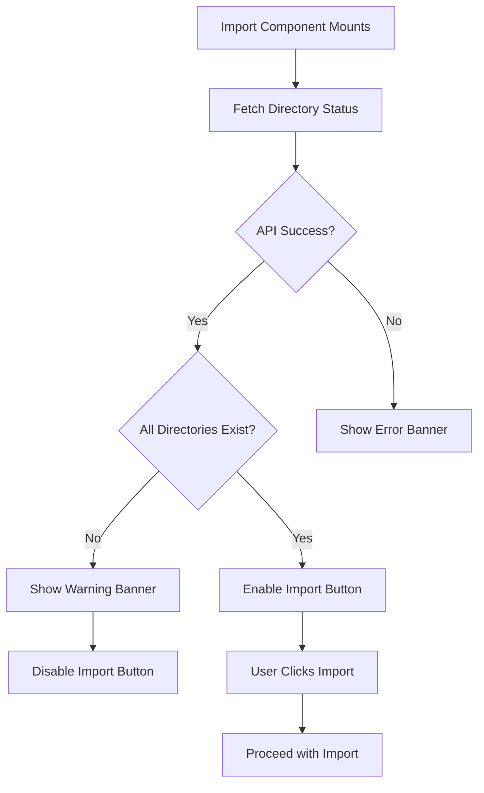

# Implementation Plan: Directory Status Check for Import.tsx

## Overview

Add functionality to `Import.tsx` that checks if the required directories (`comics` and `userdata`) exist before allowing the import process to start. If either directory is missing, display a warning banner to the user and disable the import functionality.

## API Endpoint

- **Endpoint**: `GET /api/library/getDirectoryStatus`
- **Response Structure**:
```typescript
interface DirectoryStatus {
  comics: { exists: boolean };
  userdata: { exists: boolean };
}
```

## Implementation Details

### 1. Add Directory Status Type

In [`Import.tsx`](src/client/components/Import/Import.tsx:1), add a type definition for the directory status response:

```typescript
interface DirectoryStatus {
  comics: { exists: boolean };
  userdata: { exists: boolean };
}
```

### 2. Create useQuery Hook for Directory Status

Use `@tanstack/react-query` (already imported) to fetch directory status on component mount:

```typescript
const { data: directoryStatus, isLoading: isCheckingDirectories, error: directoryError } = useQuery({
  queryKey: ['directoryStatus'],
  queryFn: async (): Promise<DirectoryStatus> => {
    const response = await axios.get('http://localhost:3000/api/library/getDirectoryStatus');
    return response.data;
  },
  refetchOnWindowFocus: false,
  staleTime: 30000, // Cache for 30 seconds
});
```

### 3. Derive Missing Directories State

Compute which directories are missing from the query result:

```typescript
const missingDirectories = useMemo(() => {
  if (!directoryStatus) return [];
  const missing: string[] = [];
  if (!directoryStatus.comics?.exists) missing.push('comics');
  if (!directoryStatus.userdata?.exists) missing.push('userdata');
  return missing;
}, [directoryStatus]);

const hasAllDirectories = missingDirectories.length === 0;
```

### 4. Create Warning Banner Component

Add a warning banner that displays when directories are missing, positioned above the import button. This uses the same styling patterns as the existing error banner:

```tsx
{/* Directory Status Warning */}
{!isCheckingDirectories && missingDirectories.length > 0 && (
  <div className="my-6 max-w-screen-lg rounded-lg border-s-4 border-amber-500 bg-amber-50 dark:bg-amber-900/20 p-4">
    <div className="flex items-start gap-3">
      <span className="w-6 h-6 text-amber-600 dark:text-amber-400 mt-0.5">
        <i className="h-6 w-6 icon-[solar--folder-error-bold]"></i>
      </span>
      <div className="flex-1">
        <p className="font-semibold text-amber-800 dark:text-amber-300">
          Required Directories Missing
        </p>
        <p className="text-sm text-amber-700 dark:text-amber-400 mt-1">
          The following directories do not exist and must be created before importing:
        </p>
        <ul className="list-disc list-inside text-sm text-amber-700 dark:text-amber-400 mt-2">
          {missingDirectories.map((dir) => (
            <li key={dir}>
              <code className="bg-amber-100 dark:bg-amber-900/50 px-1 rounded">{dir}</code>
            </li>
          ))}
        </ul>
        <p className="text-sm text-amber-700 dark:text-amber-400 mt-2">
          Please ensure these directories are mounted correctly in your Docker configuration.
        </p>
      </div>
    </div>
  </div>
)}
```

### 5. Disable Import Button When Directories Missing

Modify the button's `disabled` prop and click handler:

```tsx
<button
  className="..."
  onClick={handleForceReImport}
  disabled={isForceReImporting || hasActiveSession || !hasAllDirectories}
  title={!hasAllDirectories 
    ? "Cannot import: Required directories are missing" 
    : "Re-import all files to fix Elasticsearch indexing issues"}
>
```

### 6. Update handleForceReImport Guard

Add early return in the handler for missing directories:

```typescript
const handleForceReImport = async () => {
  setImportError(null);
  
  // Check for missing directories
  if (!hasAllDirectories) {
    setImportError(
      `Cannot start import: Required directories are missing (${missingDirectories.join(', ')}). Please check your Docker volume configuration.`
    );
    return;
  }
  
  // ... existing logic
};
```

## File Changes Summary

| File | Changes |
|------|---------|
| [`src/client/components/Import/Import.tsx`](src/client/components/Import/Import.tsx) | Add useQuery for directory status, warning banner UI, disable button logic |
| [`src/client/components/Import/Import.test.tsx`](src/client/components/Import/Import.test.tsx) | Add tests for directory status scenarios |

## Test Cases to Add

### Import.test.tsx Updates

1. **Should show warning banner when comics directory is missing**
2. **Should show warning banner when userdata directory is missing**  
3. **Should show warning banner when both directories are missing**
4. **Should disable import button when directories are missing**
5. **Should enable import button when all directories exist**
6. **Should handle directory status API error gracefully**

Example test structure:

```typescript
describe('Import Component - Directory Status', () => {
  beforeEach(() => {
    jest.clearAllMocks();
    // Mock successful directory status by default
    (axios.get as jest.Mock) = jest.fn().mockResolvedValue({
      data: { comics: { exists: true }, userdata: { exists: true } }
    });
  });

  test('should show warning when comics directory is missing', async () => {
    (axios.get as jest.Mock).mockResolvedValue({
      data: { comics: { exists: false }, userdata: { exists: true } }
    });
    
    render(<Import />, { wrapper: createWrapper() });
    
    await waitFor(() => {
      expect(screen.getByText('Required Directories Missing')).toBeInTheDocument();
      expect(screen.getByText('comics')).toBeInTheDocument();
    });
  });

  test('should disable import button when directories are missing', async () => {
    (axios.get as jest.Mock).mockResolvedValue({
      data: { comics: { exists: false }, userdata: { exists: true } }
    });
    
    render(<Import />, { wrapper: createWrapper() });
    
    await waitFor(() => {
      const button = screen.getByRole('button', { name: /Force Re-Import/i });
      expect(button).toBeDisabled();
    });
  });
});
```

## Architecture Diagram



## Notes

- The directory status is fetched once on mount with a 30-second stale time
- The warning uses amber/yellow colors to differentiate from error messages (red)
- The existing `importError` state and UI can remain unchanged
- No changes needed to the backend - the endpoint already exists
