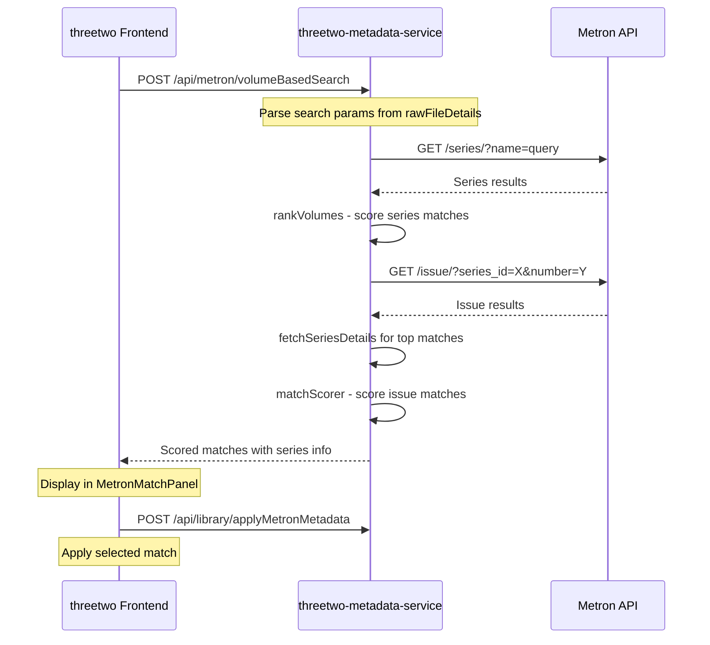

# Metron Integration Plan

## Overview

Implement metadata matching functionality for Metron (metron.cloud) in the ComicDetail action menu, following the existing ComicVine implementation pattern.

## Architecture Diagram



## Current State Analysis

### Existing ComicVine Flow
1. User clicks Match on ComicVine in action menu
2. [`useComicVineMatching`](src/client/components/ComicDetail/useComicVineMatching.ts:26) hook fetches matches
3. Calls [`COMICVINE_SERVICE_URI/volumeBasedSearch`](src/client/constants/endpoints.ts:47)
4. Backend [`volumeBasedSearch`](/Users/rishi/work/threetwo-metadata-service/services/comicvine.service.ts:188) action processes request
5. Uses [`rankVolumes`](/Users/rishi/work/threetwo-metadata-service/utils/searchmatchscorer.utils.ts:103) and [`matchScorer`](/Users/rishi/work/threetwo-metadata-service/utils/searchmatchscorer.utils.ts:58) utilities
6. Returns scored matches to UI
7. User selects match, calls `applyComicVineMetadata`

### Metron API Endpoints Required
Based on https://metron.cloud/wiki/api/api-documentation/:

| Endpoint | Purpose | Parameters |
|----------|---------|------------|
| `GET /series/` | Search for series - equivalent to CV volumes | `name`, `page` |
| `GET /series/{id}/` | Get series detail | - |
| `GET /issue/` | Search for issues | `series_id`, `number`, `cover_year` |
| `GET /issue/{id}/` | Get issue detail | - |
| `GET /publisher/` | Get publisher info | - |

---

## Implementation Plan

### Phase 1: Backend - threetwo-metadata-service

#### 1.1 Update Metron Service Configuration

**File:** [`/services/metron.service.ts`](/Users/rishi/work/threetwo-metadata-service/services/metron.service.ts)

- Move hardcoded credentials to environment variables
- Add proper error handling
- Implement rate limiting - Metron API has rate limits

```typescript
// Environment variables needed:
// METRON_USERNAME
// METRON_PASSWORD
```

#### 1.2 Implement volumeBasedSearch Action

**File:** [`/services/metron.service.ts`](/Users/rishi/work/threetwo-metadata-service/services/metron.service.ts)

Create new action mirroring ComicVine's volumeBasedSearch:

- `volumeBasedSearch` - Main search endpoint
  - Accept same payload structure as ComicVine
  - Search series by name
  - Rank series matches
  - Search issues within matched series
  - Score and return matches

#### 1.3 Implement Supporting Actions

**File:** [`/services/metron.service.ts`](/Users/rishi/work/threetwo-metadata-service/services/metron.service.ts)

- `searchSeries` - Search Metron series endpoint
- `getSeriesById` - Get series details
- `searchIssues` - Search issues with filters
- `getIssueById` - Get issue details
- `getMetronMatchScores` - Score matches using adapted algorithm

#### 1.4 Create Metron-Specific Scoring Utilities

**File:** [`/utils/metron-scorer.utils.ts`](/Users/rishi/work/threetwo-metadata-service/utils/metron-scorer.utils.ts) [NEW]

- Adapt `rankVolumes` for Metron series structure
- Adapt `matchScorer` for Metron issue structure
- Handle Metron-specific fields:
  - `series.year_began` vs CV `start_year`
  - `issue.number` format differences
  - `issue.cover_date` format

#### 1.5 Add Socket Events for Progress

**File:** [`/services/metron.service.ts`](/Users/rishi/work/threetwo-metadata-service/services/metron.service.ts)

Broadcast events for UI progress updates:
- `METRON_SCRAPING_STATUS` with stages:
  - `fetching_series`
  - `ranking_series`
  - `searching_issues`
  - `fetching_details`
  - `scoring_matches`
  - `complete`
  - `error`

---

### Phase 2: Backend - Library Service Updates

#### 2.1 Add applyMetronMetadata Action

**Location:** Library service in threetwo-core-service or threetwo-metadata-service

Create endpoint to apply selected Metron match to comic document:

```typescript
// POST /api/library/applyMetronMetadata
{
  match: MetronIssueMatch,
  comicObjectId: string
}
```

Update MongoDB document with:
```typescript
sourcedMetadata: {
  metron: {
    issue: { ... },
    seriesInformation: { ... },
    lastUpdated: Date
  }
}
```

---

### Phase 3: Frontend - threetwo

#### 3.1 Create useMetronMatching Hook

**File:** [`src/client/components/ComicDetail/useMetronMatching.ts`](src/client/components/ComicDetail/useMetronMatching.ts) [NEW]

```typescript
// Similar structure to useComicVineMatching.ts
export const useMetronMatching = () => {
  const [metronMatches, setMetronMatches] = useState([]);
  
  const fetchMetronMatches = async (searchPayload, issueSearchQuery) => {
    // POST to METRON_SERVICE_URI/volumeBasedSearch
  };
  
  const prepareAndFetchMatches = (rawFileDetails, metron?, manualOverride?) => {
    // Parse search query from file details
  };
  
  return { metronMatches, prepareAndFetchMatches };
};
```

#### 3.2 Create MetronMatchPanel Component

**File:** [`src/client/components/ComicDetail/MetronMatchPanel.tsx`](src/client/components/ComicDetail/MetronMatchPanel.tsx) [NEW]

Display Metron search results:
- Series information - name, year_began, issue_count, publisher
- Issue details - number, cover_date, image
- Match score with visual indicator
- Apply Match button

#### 3.3 Create MetronSearchForm Component

**File:** [`src/client/components/ComicDetail/MetronSearchForm.tsx`](src/client/components/ComicDetail/MetronSearchForm.tsx) [NEW]

Manual search form with fields:
- Series Name
- Issue Number
- Year

#### 3.4 Create MetronMatchResult Component

**File:** [`src/client/components/ComicDetail/MetronMatchResult.tsx`](src/client/components/ComicDetail/MetronMatchResult.tsx) [NEW]

Individual match card displaying:
- Issue cover image
- Issue name and number
- Series name
- Publisher
- Cover date
- Match score
- Apply Match button

#### 3.5 Update SlidingPanelContent

**File:** [`src/client/components/ComicDetail/SlidingPanelContent.tsx`](src/client/components/ComicDetail/SlidingPanelContent.tsx:72)

Add `MetronMatchesPanel` export similar to `CVMatchesPanel`:

```typescript
export const MetronMatchesPanel: React.FC<MetronMatchesPanelProps> = ({
  rawFileDetails,
  inferredMetadata,
  metronMatches,
  comicObjectId,
  queryClient,
  onMatchApplied,
  onManualSearch,
}) => (
  // Similar structure to CVMatchesPanel
);
```

#### 3.6 Update ComicDetail Component

**File:** [`src/client/components/ComicDetail/ComicDetail.tsx`](src/client/components/ComicDetail/ComicDetail.tsx:76)

Add Metron handling in `handleActionSelection`:

```typescript
case "match-on-metron":
  openDrawerWithMetronMatches();
  break;
```

Add new functions:
- `openDrawerWithMetronMatches()`
- Import and use `useMetronMatching` hook
- Update `renderSlidingPanelContent()` to handle `MetronMatches` case
- Update sliding panel title based on content type

#### 3.7 Update Store for Metron Events

**File:** [`src/client/store/index.ts`](src/client/store/index.ts:100)

Add Metron scraping status handling:

```typescript
metron: { scrapingStatus: "" },

socket.on("METRON_SCRAPING_STATUS", ({ message }) =>
  set((s) => ({ metron: { ...s.metron, scrapingStatus: message } }))
);
```

#### 3.8 Update Type Definitions

**File:** [`src/client/types/comic.types.ts`](src/client/types/comic.types.ts)

Add Metron-specific types:
- `MetronMetadata`
- `MetronMatchPanelProps`
- `MetronMatchResultProps`
- Update `SourcedMetadata` to include `metron`

---

## Data Structure Mapping

### Metron to ComicVine Field Mapping

| Metron Field | ComicVine Equivalent | Notes |
|--------------|---------------------|-------|
| `series.name` | `volume.name` | Direct |
| `series.year_began` | `volume.start_year` | Parse year |
| `series.issue_count` | `volume.count_of_issues` | Direct |
| `series.publisher.name` | `volume.publisher.name` | Nested |
| `issue.number` | `issue.issue_number` | May need parsing |
| `issue.cover_date` | `issue.cover_date` | Format may differ |
| `issue.image` | `issue.image.thumb_url` | Structure differs |

### Metron Response Structure

```typescript
interface MetronSeries {
  id: number;
  name: string;
  sort_name: string;
  volume: number;
  year_began: number;
  year_end: number | null;
  issue_count: number;
  publisher: {
    id: number;
    name: string;
  };
  image: string;
  resource_url: string;
}

interface MetronIssue {
  id: number;
  number: string;
  cover_date: string;
  store_date: string | null;
  image: string;
  cover_hash: string;
  series: {
    id: number;
    name: string;
  };
  resource_url: string;
}
```

---

## Environment Variables Required

### threetwo-metadata-service

```bash
# Add to docker-compose.env or .env
METRON_USERNAME=your_username
METRON_PASSWORD=your_password
```

---

## Testing Strategy

### Backend Tests
1. Unit tests for Metron API wrapper functions
2. Unit tests for scoring utilities
3. Integration tests for volumeBasedSearch flow
4. Mock Metron API responses for consistent testing

### Frontend Tests
1. Unit tests for useMetronMatching hook
2. Component tests for MetronMatchPanel
3. Integration tests for full matching flow
4. Storybook stories for MetronMatchResult

---

## File Summary

### New Files to Create

| Location | File | Purpose |
|----------|------|---------|
| threetwo-metadata-service | `utils/metron-scorer.utils.ts` | Scoring utilities for Metron |
| threetwo | `src/client/components/ComicDetail/useMetronMatching.ts` | React hook for Metron matching |
| threetwo | `src/client/components/ComicDetail/MetronMatchPanel.tsx` | Match results display |
| threetwo | `src/client/components/ComicDetail/MetronSearchForm.tsx` | Manual search form |
| threetwo | `src/client/components/ComicDetail/MetronMatchResult.tsx` | Individual match card |

### Files to Modify

| Location | File | Changes |
|----------|------|---------|
| threetwo-metadata-service | `services/metron.service.ts` | Add volumeBasedSearch and supporting actions |
| threetwo | `src/client/components/ComicDetail/ComicDetail.tsx` | Add Metron case handling |
| threetwo | `src/client/components/ComicDetail/SlidingPanelContent.tsx` | Add MetronMatchesPanel |
| threetwo | `src/client/store/index.ts` | Add Metron socket events |
| threetwo | `src/client/types/comic.types.ts` | Add Metron types |
| threetwo | `src/client/types/index.ts` | Export Metron types |

---

## Risks and Mitigations

| Risk | Mitigation |
|------|------------|
| Metron API rate limiting | Implement request throttling, cache results |
| Different data structure than CV | Create adapter layer in scoring utils |
| Credentials security | Use environment variables, never commit |
| API unavailability | Add timeout handling, user-friendly errors |
| Image URL differences | Normalize image URLs in adapter |

---

## Future Considerations

1. **GCD Integration**: Similar pattern can be followed for Grand Comics Database
2. **Unified Matching Interface**: Consider abstracting common matching logic
3. **Match History**: Store previous matches for quick re-application
4. **Batch Matching**: Allow matching multiple comics at once
5. **Preference Settings**: Let users set preferred metadata source priority
