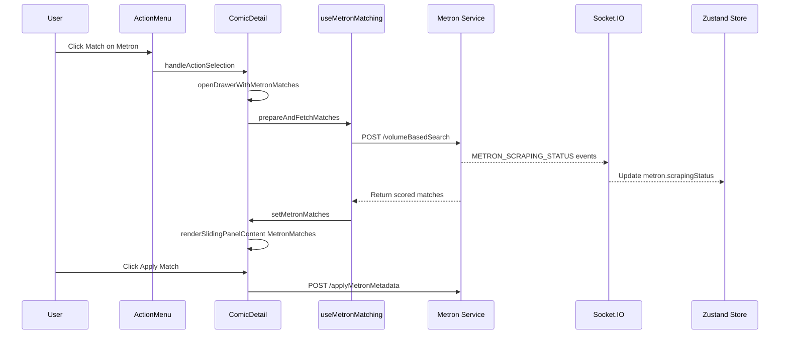

# Metron UI Integration - Implementation Plan

## Overview

Implement the frontend for Metron metadata matching, mirroring the existing ComicVine flow. The backend endpoint `volumeBasedSearch` already exists and returns scored matches.

## Architecture



## Files to Create

### 1. useMetronMatching.ts

**Path:** `src/client/components/ComicDetail/useMetronMatching.ts`

**Purpose:** Hook to fetch and manage Metron matches, similar to `useComicVineMatching.ts`

**Implementation:**
```typescript
import { useState } from "react";
import axios from "axios";
import { isNil, isUndefined, isEmpty } from "lodash";
import { refineQuery } from "filename-parser";
import { METRON_SERVICE_URI } from "../../constants/endpoints";
import { RawFileDetails as RawFileDetailsType } from "../../graphql/generated";

type MetronMatch = {
  score: number;
  issue: {
    id: number;
    issueNumber: string;
    cover_date: string;
    image: string;
    name?: string;
    desc?: string;
  };
  series: {
    id: number;
    name: string;
    year_began: number;
    issue_count: number;
    publisher?: { id: number; name: string };
    image: string;
  };
};

type MetronSearchQuery = {
  inferredIssueDetails: {
    name: string;
    number?: string;
    year?: string;
    subtitle?: string;
  };
};

type MetronMetadata = {
  name?: string;
};

export const useMetronMatching = () => {
  const [metronMatches, setMetronMatches] = useState<MetronMatch[]>([]);

  const fetchMetronMatches = async (
    searchPayload: RawFileDetailsType | undefined,
    issueSearchQuery: MetronSearchQuery
  ) => {
    try {
      const response = await axios({
        url: `${METRON_SERVICE_URI}/volumeBasedSearch`,
        method: "POST",
        data: {
          scorerConfiguration: {
            searchParams: {
              name: issueSearchQuery.inferredIssueDetails.name
                .replace(/[^a-zA-Z0-9 ]/g, "")
                .trim(),
              issueNumber: issueSearchQuery.inferredIssueDetails.number,
              year: issueSearchQuery.inferredIssueDetails.year,
              subtitle: issueSearchQuery.inferredIssueDetails.subtitle || "",
            },
          },
          rawFileDetails: searchPayload,
        },
      });

      const matches = response.data.finalMatches || [];
      const scoredMatches = matches.sort(
        (a: MetronMatch, b: MetronMatch) => b.score - a.score
      );
      setMetronMatches(scoredMatches);
    } catch (err) {
      console.error("Error fetching Metron matches:", err);
      setMetronMatches([]);
    }
  };

  const prepareAndFetchMatches = (
    rawFileDetails: RawFileDetailsType | undefined,
    metron?: MetronMetadata,
    manualOverride?: { issueName?: string; issueNumber?: string; issueYear?: string }
  ) => {
    let issueSearchQuery: MetronSearchQuery;

    if (manualOverride) {
      issueSearchQuery = {
        inferredIssueDetails: {
          name: manualOverride.issueName || "",
          number: manualOverride.issueNumber,
          year: manualOverride.issueYear,
          subtitle: "",
        },
      };
    } else if (!isUndefined(rawFileDetails) && rawFileDetails.name) {
      issueSearchQuery = refineQuery(rawFileDetails.name) as MetronSearchQuery;
    } else if (!isEmpty(metron) && metron?.name) {
      issueSearchQuery = refineQuery(metron.name) as MetronSearchQuery;
    } else {
      issueSearchQuery = { inferredIssueDetails: { name: "" } };
    }

    fetchMetronMatches(rawFileDetails, issueSearchQuery);
  };

  return {
    metronMatches,
    prepareAndFetchMatches,
  };
};
```

---

### 2. MetronMatchResult.tsx

**Path:** `src/client/components/ComicDetail/MetronMatchResult.tsx`

**Purpose:** Individual match card component displaying a single Metron match with Apply button

**Key features:**
- Display issue image, name, number, cover date
- Display series name, year began, issue count, publisher
- Show match score with visual indicator
- Apply Match button that calls `applyMetronMetadata`

**Implementation pattern:** Follow `MatchResult.tsx` structure but adapt for Metron data shape:
- `match.issue.image` instead of `match.image.thumb_url`
- `match.series.name` instead of `match.volume.name`
- `match.series.publisher.name` instead of `match.volumeInformation.results.publisher.name`
- `match.issue.issueNumber` instead of `match.issue_number`

---

### 3. MetronMatchPanel.tsx

**Path:** `src/client/components/ComicDetail/MetronMatchPanel.tsx`

**Purpose:** Container component that displays search status and match results

**Implementation:**
```typescript
import React, { ReactElement } from "react";
import MetronMatchResult from "./MetronMatchResult";
import { isEmpty } from "lodash";
import { useStore } from "../../store";
import { useShallow } from "zustand/react/shallow";
import type { MetronMatchPanelProps } from "../../types";

export const MetronMatchPanel = ({ props: metronData }: MetronMatchPanelProps): ReactElement => {
  const { comicObjectId, metronMatches, queryClient, onMatchApplied } = metronData;
  const { metron } = useStore(
    useShallow((state) => ({
      metron: state.metron,
    }))
  );

  return (
    <div>
      {!isEmpty(metronMatches) ? (
        <MetronMatchResult
          matchData={metronMatches}
          comicObjectId={comicObjectId}
          queryClient={queryClient}
          onMatchApplied={onMatchApplied}
        />
      ) : (
        <>
          <article
            role="alert"
            className="mt-4 rounded-lg max-w-screen-md border-s-4 border-yellow-500 bg-yellow-50 p-4 dark:border-s-4 dark:border-yellow-600 dark:bg-yellow-300 dark:text-slate-600 text-sm"
          >
            <div>
              <p>Metron match results are an approximation.</p>
              <p>
                If you see no results or poor quality ones, you can override
                the search query parameters to get better ones.
              </p>
            </div>
          </article>
          <div className="text-md my-5">{metron.scrapingStatus}</div>
        </>
      )}
    </div>
  );
};

export default MetronMatchPanel;
```

---

### 4. MetronSearchForm.tsx

**Path:** `src/client/components/ComicDetail/MetronSearchForm.tsx`

**Purpose:** Manual search form for Metron, pre-populated from rawFileDetails

**Implementation:** Follow `ComicVineSearchForm.tsx` pattern with fields:
- Series Name (text input)
- Issue Number (text input)
- Year (text input)
- Submit button

---

## Files to Modify

### 5. SlidingPanelContent.tsx

**Path:** `src/client/components/ComicDetail/SlidingPanelContent.tsx`

**Changes:**
1. Import new components:
   ```typescript
   import { MetronSearchForm, MetronSearchFormValues } from "./MetronSearchForm";
   import { MetronMatchPanel } from "./MetronMatchPanel";
   ```

2. Add `MetronMatchesPanelProps` interface:
   ```typescript
   interface MetronMatchesPanelProps {
     rawFileDetails?: RawFileDetails;
     inferredMetadata: InferredMetadata;
     metronMatches: any[];
     comicObjectId: string;
     queryClient: any;
     onMatchApplied: () => void;
     onManualSearch: (formValues: MetronSearchFormValues) => void;
   }
   ```

3. Add `CollapsibleMetronSearchForm` component (similar to `CollapsibleSearchForm`)

4. Export `MetronMatchesPanel` component:
   ```typescript
   export const MetronMatchesPanel: React.FC<MetronMatchesPanelProps> = ({
     rawFileDetails,
     inferredMetadata,
     metronMatches,
     comicObjectId,
     queryClient,
     onMatchApplied,
     onManualSearch,
   }) => (
     <>
       <div className="border-slate-500 border rounded-lg p-2 mb-3">
         <p className="text-slate-600 dark:text-slate-300">Searching for:</p>
         {inferredMetadata.issue ? (
           <>
             <span className="text-slate-800 dark:text-slate-100 font-medium">
               {inferredMetadata.issue?.name}{" "}
             </span>
             <span className="text-slate-600 dark:text-slate-300">
               # {inferredMetadata.issue?.number}
             </span>
           </>
         ) : null}
       </div>

       <CollapsibleMetronSearchForm
         rawFileDetails={rawFileDetails}
         onManualSearch={onManualSearch}
       />

       <MetronMatchPanel
         props={{
           metronMatches,
           comicObjectId,
           queryClient,
           onMatchApplied,
         }}
       />
     </>
   );
   ```

---

### 6. ComicDetail.tsx

**Path:** `src/client/components/ComicDetail/ComicDetail.tsx`

**Changes:**

1. Import the new hook and panel:
   ```typescript
   import { useMetronMatching } from "./useMetronMatching";
   import { CVMatchesPanel, MetronMatchesPanel, EditMetadataPanelWrapper } from "./SlidingPanelContent";
   ```

2. Add the hook usage (line ~56):
   ```typescript
   const { metronMatches, prepareAndFetchMatches: prepareAndFetchMetronMatches } = useMetronMatching();
   ```

3. Add `openDrawerWithMetronMatches` function (after `openDrawerWithCVMatches`):
   ```typescript
   const openDrawerWithMetronMatches = (): void => {
     prepareAndFetchMetronMatches(rawFileDetails, sourcedMetadata?.metron);
     setSlidingPanelContentId("MetronMatches");
     setVisible(true);
   };
   ```

4. Update `handleActionSelection` switch statement (line ~76):
   ```typescript
   case "match-on-metron":
     openDrawerWithMetronMatches();
     break;
   ```

5. Update `renderSlidingPanelContent` function to handle MetronMatches case:
   ```typescript
   case "MetronMatches":
     return (
       <MetronMatchesPanel
         rawFileDetails={rawFileDetails}
         inferredMetadata={inferredMetadata}
         metronMatches={metronMatches}
         comicObjectId={comicObjectId || _id}
         queryClient={queryClient}
         onMatchApplied={() => {
           setVisible(false);
           setActiveTab(1);
         }}
         onManualSearch={(formValues) =>
           prepareAndFetchMetronMatches(rawFileDetails, sourcedMetadata?.metron, formValues)
         }
       />
     );
   ```

6. Update sliding panel title to be dynamic based on content:
   ```typescript
   title={slidingPanelContentId === "MetronMatches" ? "Metron Search Matches" : "Comic Vine Search Matches"}
   ```

---

### 7. store/index.ts

**Path:** `src/client/store/index.ts`

**Changes:**

1. Add `metron` state to interface (line ~42):
   ```typescript
   metron: {
     scrapingStatus: string;
   };
   ```

2. Add socket event handler (after line ~102):
   ```typescript
   socket.on("METRON_SCRAPING_STATUS", ({ message }) =>
     set((s) => ({ metron: { ...s.metron, scrapingStatus: message } }))
   );
   ```

3. Initialize metron state (line ~123):
   ```typescript
   metron: { scrapingStatus: "" },
   ```

---

### 8. comic.types.ts

**Path:** `src/client/types/comic.types.ts`

**Changes:** Add Metron-specific types:

```typescript
/**
 * Metron issue match from volumeBasedSearch
 */
export type MetronMatch = {
  score: number;
  issue: {
    id: number;
    issueNumber: string;
    cover_date: string;
    image: string;
    name?: string;
    desc?: string;
  };
  series: {
    id: number;
    name: string;
    year_began: number;
    issue_count: number;
    publisher?: { id: number; name: string };
    image: string;
  };
};

/**
 * Props for MetronMatchPanel component.
 */
export type MetronMatchPanelProps = {
  props: {
    metronMatches: MetronMatch[];
    comicObjectId: string;
    queryClient?: unknown;
    onMatchApplied?: () => void;
  };
};

/**
 * Props for MetronMatchResult component.
 */
export type MetronMatchResultProps = {
  matchData: MetronMatch[];
  comicObjectId: string;
  queryClient?: any;
  onMatchApplied?: () => void;
};

/**
 * Props for MetronMatchesPanel in SlidingPanelContent.
 */
export type MetronMatchesPanelProps = {
  rawFileDetails?: RawFileDetailsType;
  metronMatches: MetronMatch[];
  comicObjectId: string;
  inferredMetadata?: InferredMetadata;
  queryClient?: unknown;
  onMatchApplied?: () => void;
  onManualSearch?: (formValues: { issueName?: string; issueNumber?: string; issueYear?: string }) => void;
};
```

---

### 9. types/index.ts

**Path:** `src/client/types/index.ts`

**Changes:** Export new Metron types (add to Comic Detail types section):

```typescript
export type {
  // ... existing exports
  MetronMatch,
  MetronMatchPanelProps,
  MetronMatchResultProps,
  MetronMatchesPanelProps,
} from "./comic.types";
```

---

## Backend Integration Notes

The backend `volumeBasedSearch` endpoint expects:

```typescript
{
  scorerConfiguration: {
    searchParams: {
      name: string;       // Series name to search
      issueNumber?: string;
      year?: string;
      subtitle?: string;
    }
  },
  rawFileDetails?: object;
}
```

And returns:

```typescript
{
  finalMatches: ScoredMetronMatch[];
  rawFileDetails?: object;
  scorerConfiguration: object;
}
```

Where `ScoredMetronMatch` contains:
- `score: number` - Match confidence score
- `issue: MetronIssueDetail` - Full issue details
- `series: MetronSeriesBasic` - Series info

---

## applyMetronMetadata Endpoint

**Note:** The `applyMetronMetadata` endpoint needs to be created in the library service. For now, the Apply Match button should call:

```typescript
POST ${LIBRARY_SERVICE_BASE_URI}/applyMetronMetadata
{
  match: MetronMatch,
  comicObjectId: string
}
```

This should update the comic document with:
```typescript
sourcedMetadata: {
  metron: {
    issue: { ... },
    seriesInformation: { ... },
    lastUpdated: Date
  }
}
```

---

## Implementation Order

1. **Types first** - Add types to `comic.types.ts` and export from `types/index.ts`
2. **Store update** - Add metron state and socket handler to `store/index.ts`
3. **Hook** - Create `useMetronMatching.ts`
4. **Components** - Create in order:
   - `MetronSearchForm.tsx`
   - `MetronMatchResult.tsx`
   - `MetronMatchPanel.tsx`
5. **SlidingPanelContent** - Add `MetronMatchesPanel` export
6. **ComicDetail** - Wire up the action handler and panel rendering

---

## Testing Checklist

- [ ] Click Match on Metron opens sliding panel
- [ ] Search query is inferred from rawFileDetails
- [ ] Status messages display during search
- [ ] Results display sorted by score
- [ ] Best match is highlighted
- [ ] Manual search form works
- [ ] Apply Match button calls correct endpoint
- [ ] Panel closes after applying match
- [ ] Error states are handled gracefully
